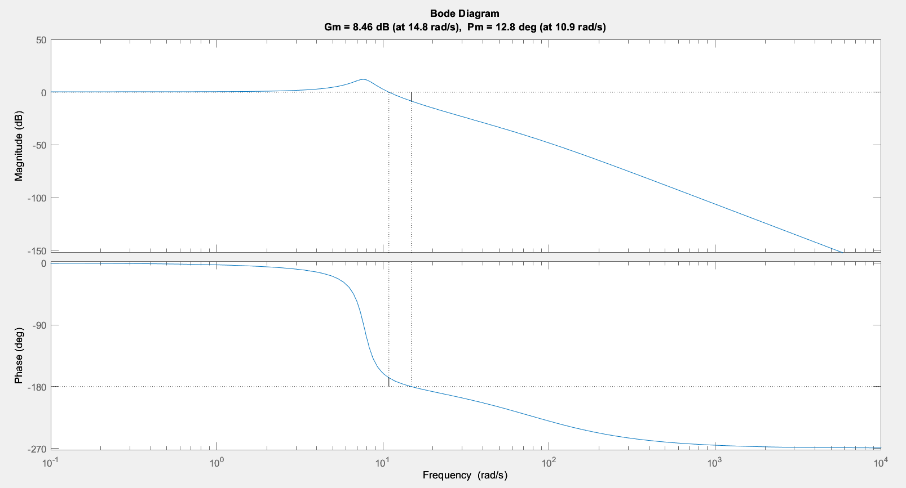

# Progetto-CAT2-Luca-Boni
Progettazione regolatore per sistema discreto definito con un ingresso a gradino
# Progetto CAT 2 2023

## di Luca Boni

#### Ingegneria dell’Automazione

#### Progetto n.


## Consegna Progetto

Si consideri il sistema descritto dalla funzione di trasferimento

𝐺(𝑠)= 𝑠+ 80 5000 𝑠 (^2) +2𝑠+ 60
Si richiede di progettare un regolatore che soddisfi le seguenti specifiche:

- Errore a regime nullo in presenza di ingresso di riferimento a gradino di ampiezza massima pari a 2.0 e disturbo sull’uscita a gradino di
ampiezza massima pari a 0.1.
- Massima sovraelongazione della risposta al gradino di riferimento inferiore al 5%.
- Tempo di assestamento al 1% della risposta al gradino di riferimento inferiore a 0.8s.
- Margine di fase superiore a 40 gradi, per garantire robustezza.

Sulla misura è sovrapposto un rumore di misura sinusoidale a frequenza 2000rad/s e ampiezza massima pari a 0.005.

La soluzione proposta non deve presentare marcate code di assestamento.

Dimensionare l’attuatore al fine di garantire il funzionamento a regime (in presenza contemporanea del riferimento, dei disturbi e del
rumore) e valutare di quanto deve essere sovradimensionato per gestire il transitorio.


## Analisi del Plant


Abbiamo un polo
reale a -80 e 2 poli
complessi
coniugati
```
```
ቊ2𝜔𝛿=^2
𝜔^2 = 60
```
```
G
ω 7,745967rad/s
δ 0,
𝜎 26,
Mf 12,802gradi
Ma 8,4584dB
omegac 10,863rad/s
omegaf 14,832rad/s
```

## Regolatore statico (Rs)

##### la parte statica deve:

- garantire errore in uscita a regime nullo
- compensare un errore sull'uscita a gradino di ampiezza 0.

##### È necessario un polo nell'origine per sopperire alla prima richiesta, soddisfando così anche la seconda, visto

##### l’andamento costante di un disturbo a gradino:

##### Così facendo possiamo definire la G estesa:

###### 𝑅𝑠=

###### 1

###### 𝑠

###### 𝐺𝑒 = 𝑅𝑠∗𝐺


## Sistema esteso (Ge)

```
per specifiche di Mf
```
```
per specifiche di 𝑇𝑎1%
```
```
per compensazione
del disturbo n(t)
```
```
Specifiche date:
```
- 𝑇𝑎1% ≤ 0 , 8
    (𝜔𝑐≥ 14 , 375 𝑟𝑎𝑑/𝑠)
- 𝑀𝑓≥40°
- 𝑆%≤5%
    (𝛿≥ 0 , 75 )
- Attenuare n(t)
    (ωn=2000 rad/s;
    An=- 46dB )

```
Ci troviamo in uno
scenario B piuttosto
gravoso che ci richiede
di utilizzare una o più
reti anticipatrici
```

## Progetto rete anticipatrice (Rd)

Devo fare in modo di avere Mf più alto di 40 gradi a pulsazioni superiori di 14,375;

devo, quindi, dare uno sfasamento positivo molto ampio per avere un margine di fase idoneo sotto quella determinata
pulsazione.

Utilizzerò quindi 3 zeri reali per garantire il margine di fase maggiore di 40 gradi in quella specifica banda di frequenze,
accoppiati con 2 poli per garantire la realizzabilità fisica:

- Scelgo 𝜔𝑐 ≅ 20 𝑟𝑎𝑑𝑠 =⇒|Ge(𝜔𝑐) |= −41.1 ; Arg(Ge(𝜔𝑐)= −
- Mf imposto=75 → Sfasamento da imporre = 172 °=⇒𝑅ℎ𝑜= 1 , 65

###### - 𝜏𝑧 =

```
𝑅ℎ𝑜
𝜔𝑐^ ; 𝜏𝑝 =
```
```
1
10 ∗𝜔𝑐^
```
- 𝐴 = 20 log 10 ( 1 +𝑅ℎ𝑜^2 ) =⇒ 𝜇= 0 , 68 ∗ 10

```
2 ∗𝐴+𝜔𝑐
```
− (^20)

###### 𝑅𝑑 = 20 , 7336 ∗

###### 1 + 0. 0 825𝑠^3

###### 1 + 0 ,005𝑠^5

###### 𝐿=𝑅𝑑 ∗𝐺𝑒


## Sistema ad anello aperto (L)

```
per specifiche di 𝑇𝑎1%
```
```
per specifiche di Mf
```
```
per compensazione
del disturbo n(t)
```
```
Risultati ottenuti:
```
- ωc = 25.2807 rad/s
- Mf = 54.5836°
- 𝐿(𝑗ω _n_ ) ≤−46𝑑𝐵


## Risposta a gradino sistema in retro

```
Dall’andamento nel tempo della
risposta a gradino possiamo
notare 2 cose:
```
- È ampiamente rispettata la
    specifica sul tempo di
    assestamento
- C’è una sovraelongazione del
    segnale maggiore del 5% (0,1)

```
Possiamo utilizzare una rete che
arrotondi il segnale di riferimento
in modo da abbassare la
sovraelongazione
```

### Compensazione del segnale di riferimento (Rfp)

###### 𝑅𝑓𝑝=

###### 1

###### 1 +𝜔^1

```
𝑐
```
###### 𝑠

###### =

###### 1

###### 1 + 0 ,05𝑠

#### w wf


## Azione in avanti (Rff)

```
Ho poi migliorato
ulteriormente
l’inseguimento del
riferimento con una rete
feed forward andando in
cancellazione ai poli CC
del sistema.
```
###### 𝑅𝑓𝑓=

###### (𝑠^2 +2𝑠+ 60 )

###### 𝑠+ 1000 2

```
Specifiche soddisfatte:
```
- 𝑇𝑎1% ≤ 0 , 8
- 𝑆%≤5%


## Sistema su Simulink


## Funzione di sensitività del controllo

###### - 𝑀𝑓≥40°

###### - 14 , 375 <𝜔𝑐< 2000

###### - 𝑇𝑎1% ≤ 0 , 8

###### - 𝑆%≤5%

```
Si può notare come la
funzione si sensibilità
del controllo Q con
linea rossa attraversi lo
0 prima dei 2000 rad/s
in modo da attenuare il
disturbo di misura
```

## Uscite del sistema e(t) e u(t)

```
e(t) u(t)
```

## Cerco di migliorare lo sforzo di controllo

Per diminuire il picco ho:

- Abbassato la frequenza di taglio del filtro passa basso in compensazione del segnale di riferimento

```
𝑅𝑓𝑝=
```
###### 1

###### 1 +

###### 1

###### 0 , 6 𝜔𝑐𝑠

- ho abbassato il margine di fase richiesto all’Rd da 75° a 50° → 𝜑 = 147 → 𝜌= 1. 4 da grafico


## Conclusioni sull’attuatore

```
Dall’andamento temporale dell’uscita del regolatore u(t) si notano dei picchi fino a 2,3 volte il
riferimento durante la fase transitoria
```
```
per cui bisogna sovradimensionare l’attuatore tenendo conto di questi picchi, dando tolleranze ai
componenti del sistema almeno 2,3 volte superiori al riferimento.
```
```
Inoltre vi è un picco negativo dovuto al disturbo a gradino sull’uscita, che deve essere considerato
magari con un circuito di recupero energetico come un ramo di frenatura, per evitare danneggiamenti
all’attuatore stesso.
```

## Funzioni di sensitività


## Per trovare il Rho

```
Per trovare il Rho corretto ho utilizzato il
grafico presente sulle slide delle reti correttive.
```
```
Utilizzando 3 zeri per la rete divido per 3 lo
sfasamento 𝜑 che devo applicare:
```
```
172
3
```
###### = 57 , 33

```
Nel grafico allo sfasamento di 57,33°
corrisponde una 𝜌≈ 6 , 5
```

